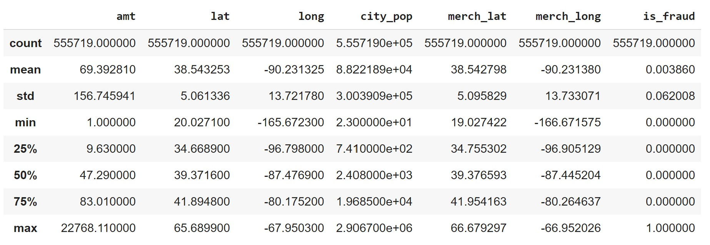
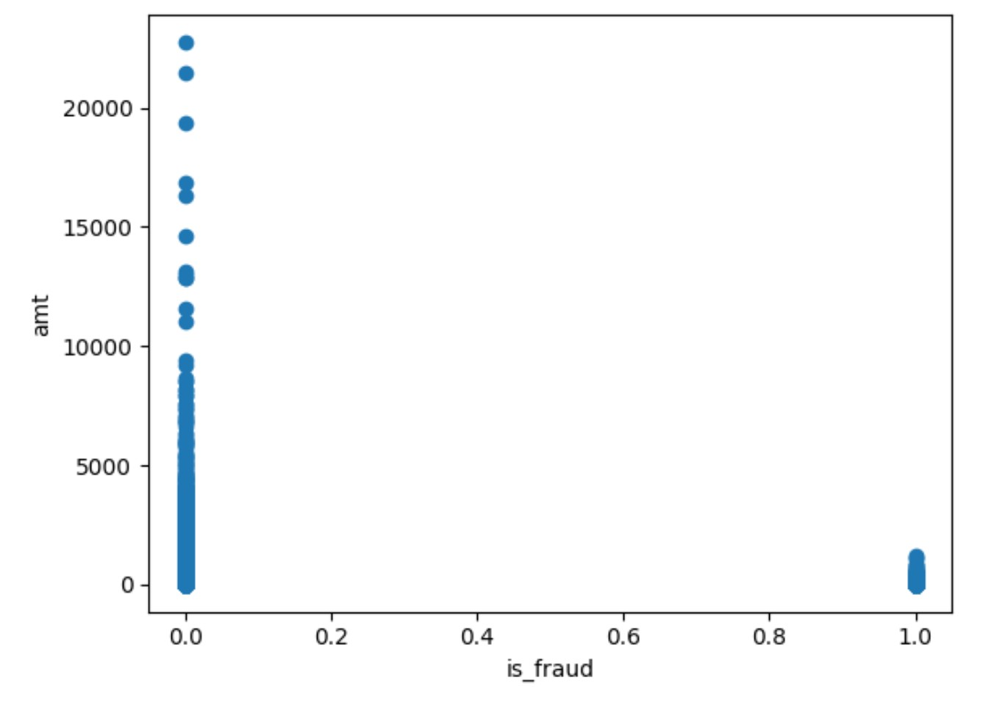
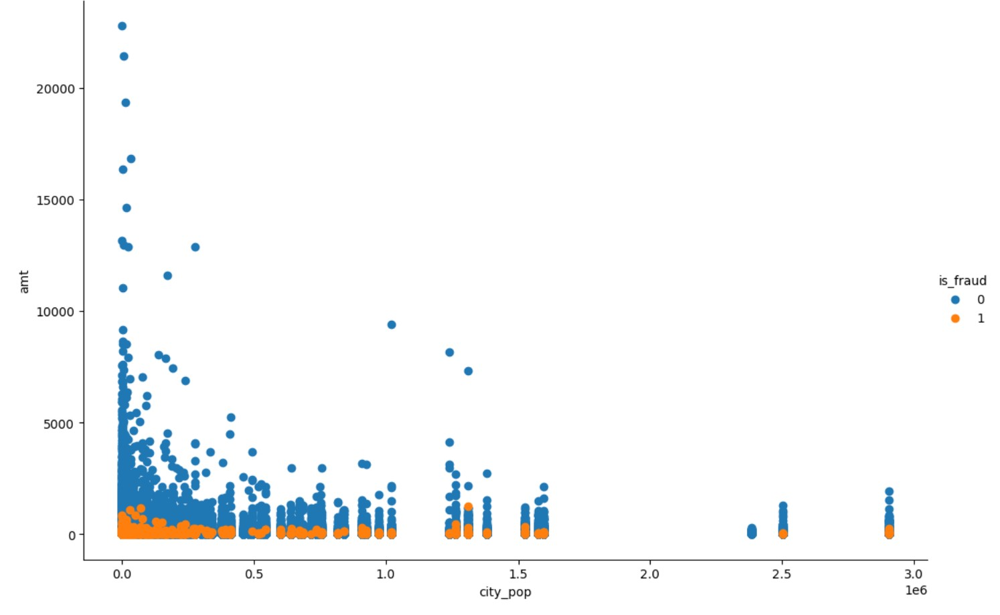
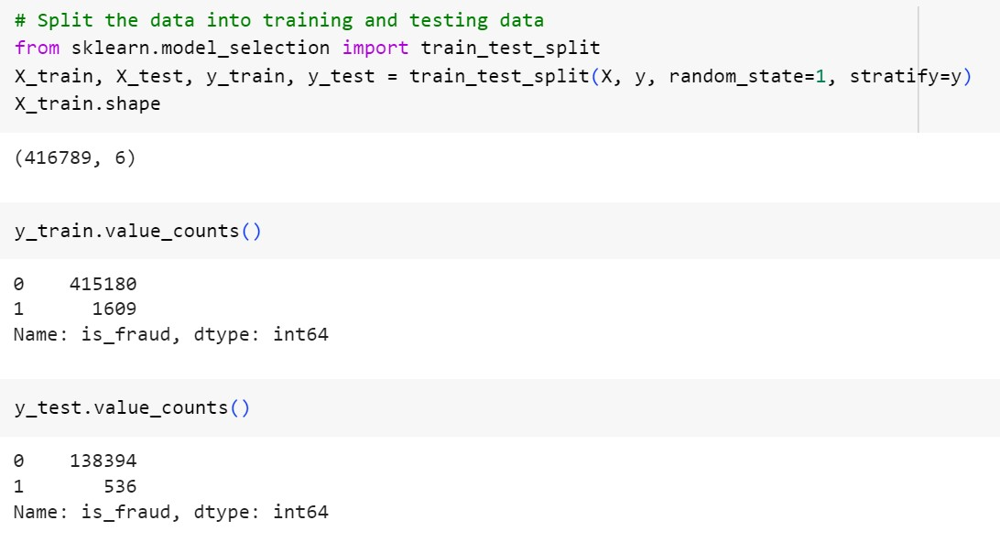
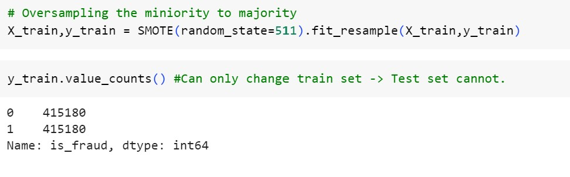

# The Final_Project
## Credit Card Fraud Analysis and Detection Using Machine Learning Tools and Techniques

# 1. Introduction:
Credit card fraud is a significant concern for financial institutions and individuals alike. It can result in substantial financial losses and damage to the reputation of both the cardholders and the issuing banks. To address this issue, the application of machine learning techniques has gained significant attention. This project is an extension of Project 3 (Credit Card Fraud Visualization) and aims to develop a credit card fraud analysis system using machine learning tools and techniques to detect and prevent fraudulent transactions effectively.

# 2. Objectives:
The primary objectives of this project are as follows:
1.  To develop an interactive web application that showcases the analytical studies and visualization of credit card frauds for the sourced dataset.
2.	To study, compare and develop the most accurate supervised machine learning algorithm/model to detect fraudulent transactions.

# 3. Tools and Techniques used:
 * Languages: Python, JavaScript, HTML.
 * Libraries: Pandas, Numpy, Beautiful Soup, Splinter, Matplotlib, Scikit-Learn.
* Tools: Jupyter Notebook, V S Code, Google Colab.

# 4.Methodology:
1. Data Scrapping from www.keggal.com

2.	ETL and cleaning of the required dataset.

3.	Interactive Web app development
   * Developed interactive flask app for visualization of the data.

4.	Machine Learning Model Development:
* Load the data from the CSV file.
* Clean the data: drop non-numeric columns and prepare required data frame.
* Describe the data of the data frame:

* Data Visualization
*	a. Relationship between the amount of transaction and fraudulent or non-fraudulent category of transaction.

*	b. Relationship among the amount, fraudulent or non-fraudulent category, and city population of transactions.

*	MACHINE LEARNING
i.	Split the data into X(features) and y(target), and then into testing and training sets.
ii.	‘is_fraud’ column is set as our target and the rest are features.
iii.	Split the data into testing and training sets.

iv. Since y_train value is highly imbalanced and discrete, we used SMOTE(Synthesized Minority Oversampling Technique) for oversampling minority to majority class to balance the dataset. It improves the model performance by balancing the dataset.

v. Normalization of testing and training sets
vi. Run the models:
  * Model 1: Logistic Regression
  * Model 2: Decision Tree
  * Model 3: Random Forest
  * Model 4: Gradient Boosting
  * Model 5: Neural Network
* For each model the datasets (training and testing) were fit, trained into the model, predicted, created confusion matrix, and finally calculated the accuracy score.
vii.	Accuracy comparison of the models
* The test and train accuracy score of each model is compared

# SUMMARY and CONCULSION
*	All Fraud Transactions occur for an amount below 2500. Thus, the bank can infer clearly that the fraud committers try to commit frauds of smaller amounts to avoid suspicion.
*	The fraud transactions are equitable distributed throughout range of city popoluation and there is no clear relationship of city popoluation with commiting of fraud.
*	The number of fraud transactions are very few comparted to legitimate transactions and it has to be balanced in order for a fair comparison to prevent the model from overfitting.
*	SMOTE overcomes overfitting by synthetically oversampling minority class labels.
*	Among 5 different models used, Random Forest Model and Decision Tree model gave the maximum accuracy for Test set and Train set. Random Forest Algorithm is robust against overfitting, robust to outliers and non-linear data and runs efficiently on large database. Hence, we would choose Random Forest method over Decision Tree model for our dataset to predict fraudulant transaction.

# Limitations/challenges:
* The limitation for the project is the data source. To detect fraudulent transaction using machine learning requires large amounts of high-quality data to learn and make accurate predictions.
* Another limitation/challenge is the dynamic nature of fraud patterns. Fraudsters are continually evolving their tactics, and new fraud patterns emerge regularly.

# Scope: 
* Continuous monitoring of data and machine learning models, updating the models, and retraining them to detect new patterns.
* Use a combination of supervised and unsupervised learning methods to analyze large amounts of data and detect patterns that are indicative of fraudulent activities. Using unsupervised machine learning algorithms can identify new fraud patterns as they emerge, enabling banks to stay ahead of fraudsters’ tactics.
* Leverage human intelligence to validate suspicious activities, ensuring the accuracy of the fraud detection system. Combining machine learning with human intelligence can reduce the number of false positives, enabling banks to focus their resources on genuine fraud cases. 

# Team members: 
 Layla Abdul Sater, Osmar eduardo luna luactero, Alessia Presotto, Priscila 
Glienke , Romi Oinam

